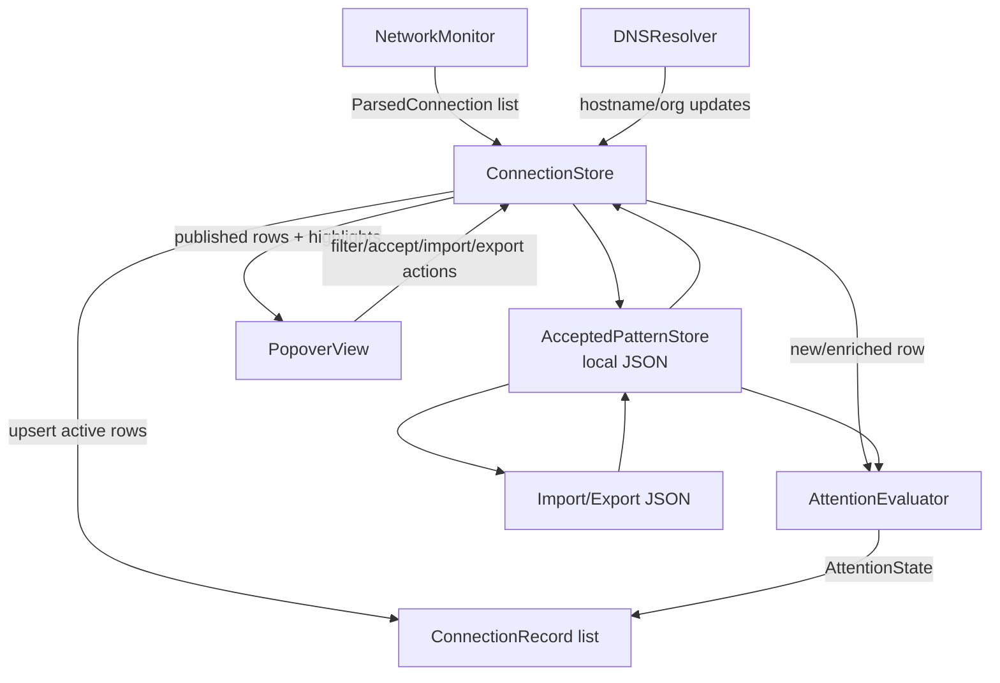

# System Design & Architecture

## Architecture Overview



The feature should stay inside the existing local app architecture. `NetworkMonitor` continues polling `lsof`; `ConnectionStore` remains the main actor state owner; SwiftUI observes published state.

## Data Models

Proposed internal concepts:

```swift
enum AttentionState: String, Sendable, Hashable {
    case accepted
    case needsAttention
}

struct AttentionResult: Sendable, Hashable {
    let state: AttentionState
    let message: String
    let acceptedPatternID: String
}

struct AcceptedHighlightPattern: Codable, Sendable, Hashable {
    let processName: String
    let value: String
    let org: String?
}
```

`ConnectionRecord` should gain highlight fields rather than introducing a separate row model. This keeps the existing `ConnectionStore.connections` publication path intact and avoids a second UI projection layer for v1.

Proposed additions:

```swift
struct ConnectionRecord: Identifiable, Hashable, Sendable {
    var attention: AttentionResult
}
```

The attention result is derived from `processName` and the current endpoint value. Existing `lastSeen` continues to represent the latest observed poll time.

Persistent accepted-pattern store:
- local JSON document in the user's application support directory
- plain JSON object keyed by accepted-pattern id
- each value contains `processName`, `value`, and optional `org`
- `value` is the accepted endpoint string, preferably host:port when hostname is available, otherwise IP:port
- `org` preserves organization context when available, but does not participate in id generation
- ids are generated as `<process-slug>--<value-slug>`

Storage location:
- Use `FileManager.default.urls(for: .applicationSupportDirectory, in: .userDomainMask).first`.
- Store data under `NetworkTracer/accepted-patterns.json`.
- Create the `NetworkTracer` directory if missing.
- Write atomically by encoding to a temporary file and replacing the destination.
- If the file is missing, start with an empty accepted-pattern dictionary.

## API Design

Candidate internal APIs:

```swift
struct HighlightConfiguration {
    var preferHostnameEndpoint: Bool
}

@MainActor
final class ConnectionStore: ObservableObject {
    var highlightedOnly: Bool { get set }
    var acceptedPatterns: [String: AcceptedHighlightPattern] { get }

    func acceptHighlight(processName: String, value: String, org: String?)
    func removeAcceptedHighlightPattern(id: String)
    func importAcceptedPatterns(from url: URL) throws -> ImportSummary
    func exportAcceptedPatterns(to url: URL) throws
}

struct ImportSummary {
    let added: Int
    let duplicates: Int
    let rejected: Int
    let filledMissingOrg: Int
}

struct AttentionEvaluator {
    func evaluate(record: ConnectionRecord,
                  acceptedPatterns: [String: AcceptedHighlightPattern],
                  configuration: HighlightConfiguration) -> AttentionResult
}
```

## Component Breakdown

- `AttentionEvaluator`: pure accepted-pattern check, heavily unit tested.
- `AcceptedPatternStore`: loads, saves, validates, imports, exports, merges, and removes user-accepted highlight patterns.
- `ConnectionStore`: updates baseline and re-evaluates highlights when records are created, refreshed, or enriched.
- `ConnectionRecord`: carries attention result to the UI.
- `PopoverView`: displays markers, reason text, attention count, needs-attention-only filter, accept actions, and import/export/review entry points.

## Matching Semantics

Accepted patterns are matched against a process plus one accepted endpoint value.

Endpoint acceptance:
- `value` is the current endpoint value, preferably hostname:port when hostname is available, otherwise IP:port.
- `org` is optional metadata copied from the row when available.
- Marks the row accepted when `processName + value` matches the accepted-pattern store.

Organization acceptance:
- Deferred for v1.
- `org` is stored only as optional metadata on endpoint acceptance records.
- `org` does not participate in attention matching.

The accepted-pattern JSON does not include an explicit scope. For v1, evaluation compares only the current endpoint value against accepted `value`s for the same process.

## UI Flow

Highlighted row actions:
- `Accept Endpoint` writes the current endpoint value, preferably hostname:port when available, otherwise IP:port.

The action writes the generated id and `{ processName, value, org? }` to the accepted-pattern store, then immediately re-evaluates visible rows.

Management UI:
- `Accepted Patterns...` opens a compact list of accepted ids, process names, values, and orgs.
- Users can remove one accepted pattern.
- Users can export the JSON file.
- Users can import a JSON file and see an import summary.
- The import summary should report added, duplicates, rejected, and org-filled counts.

## Design Decisions

| Decision | Choice | Rationale |
|---|---|---|
| Rule model | Accepted endpoint check | Keeps v1 simple: if process + endpoint exists in JSON, accepted; otherwise needs attention. |
| Accepted pattern lifetime | Persistent local JSON | User explicitly asked to keep accepted decisions and move them across machines. |
| Core data dependency | Host/IP plus port | Works even when external org enrichment fails or is disabled. |
| Org metadata | Optional display context | Useful context, but not part of v1 acceptance matching. |
| UI posture | Quiet markers and labels | Prevents the app from feeling like an alarm console. |
| Import/export format | Plain JSON object keyed by id | Human-readable, portable, fast to look up/remove by id, and intentionally minimal. |
| Accepted storage path | `~/Library/Application Support/NetworkTracer/accepted-patterns.json` | Standard per-user app support location; local-only and easy to export/import. |
| Org-only acceptance | Deferred | Keeps v1 endpoint-based; org remains metadata in accepted records. |
| Hostname timing | Re-evaluate when hostname resolves | A row may move from IP:port attention to hostname:port accepted after enrichment. |
| Attention data location | Add fields to `ConnectionRecord` | Keeps the existing published list as the single UI source of truth for v1. |

## Accepted Pattern ID Generation

Generate ids deterministically from the accepted process/value pair. `org` is metadata and must not affect the id.

```swift
func acceptedPatternID(processName: String, value: String) -> String {
    "\(slug(processName))--\(slug(value))"
}
```

Design constraints:
- `slug` lowercases, trims whitespace, replaces non-alphanumeric runs with `-`, and trims leading/trailing `-`.
- Matching uses the canonical accepted-pattern id plus a stored `processName + value` equality check.
- If import sees the same id mapped to different `processName` or `value`, reject the conflicting record and report it instead of overwriting.
- If import sees a non-canonical id for the imported `processName + value`, reject the record instead of supporting alternate ids at runtime.
- If imported duplicate data includes `org` and the local record lacks it, the store may fill the missing local `org`; otherwise local values should win.

## Rule Timing & Defaults

Default configuration:
- Prefer hostname endpoint values when hostname is available.
- Fall back to IP:port when hostname is unavailable.

Endpoint behavior:
- New rows are evaluated immediately.
- If hostname later resolves, recompute the endpoint value and re-evaluate attention state.
- If either IP:port or hostname:port is accepted, the row can be treated as accepted. This avoids forcing users to re-accept a row only because hostname enrichment arrived later.
- If neither endpoint value is accepted, the row needs attention.

## Non-Functional Requirements

- Highlight evaluation should be fast enough to run during every store update without visible UI delay.
- Rule evaluation should be deterministic and testable without network access.
- The feature should not increase `lsof` polling frequency.
- DNS/org lookup failures must degrade gracefully.
- Highlight state must update when async hostname/org results arrive.
- Accessibility should not rely on color alone; reasons must be available as text.
- Accepted-pattern load/save must fail safely; malformed files should not corrupt existing accepted data.
- Import/export should not require network access.
